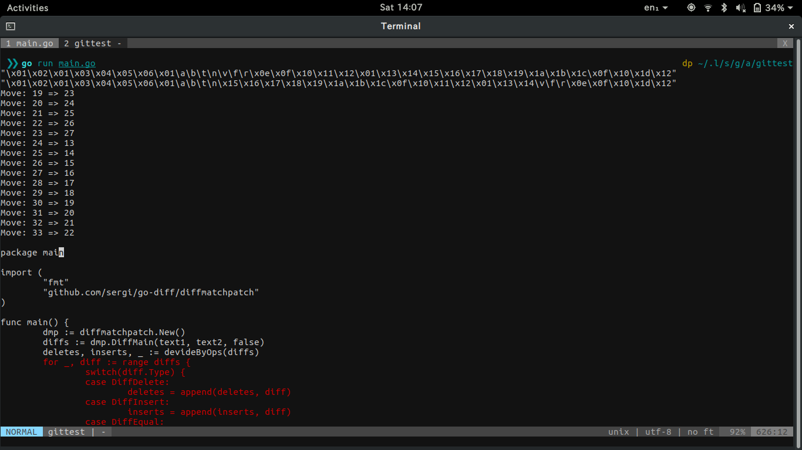

# ACL MoveにつよいGitを作る 第三週目

## 動機

`git diff` したときに「コードの移動」がされているとすごくわかりにくい。

- 移動なのかそうではないのかがぱっと見でわからない
- 移動しただけなのか、少し変えて移動したのかがぱっと見でわからない

## 技術的な解決の方針

レーヴェンシュタイン距離のアルゴリズムを拡張し、移動している行とそうでない行を割り出す。また、移動している行は何行目から何行目に移動しているのか割り出す。

便利なCLIを作って解決する。

## 今回の目標

使いやすさと汎用性を兼ね揃えた CLI の UI を考える。

考えること:

- CLI のオプションや、引数のしくみ
- それぞれのオプションにおける動作

最低できるようにしたいこと:

- 「移動された行」だけ Git で add したい
- 移動された行と削除/追加の行を一度に見たい
- 標準入力とファイルからのどちらからの入力にも対応したい

## 手順

1. 読む [コマンドラインツールについて語るときに僕の語ること #yapcasia // Speaker Deck](https://speakerdeck.com/tcnksm/komandorainturunituiteyu-rutokinipu-falseyu-rukoto-number-yapcasia)
2. それぞれで最強の CLI を考える
3. それぞれメリットとデメリットを発表する
